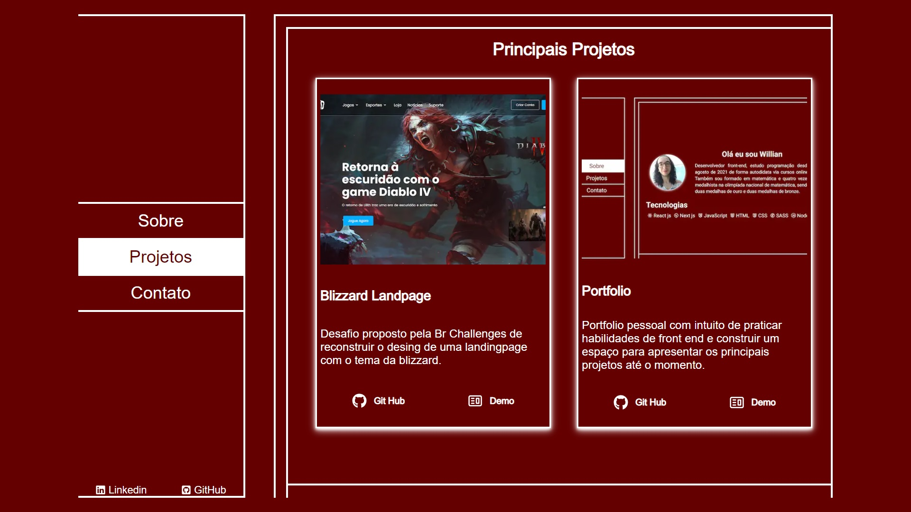
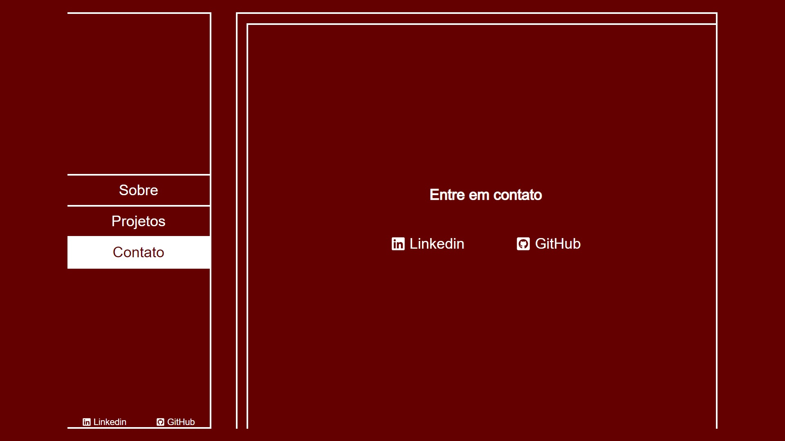

# Portfolio Willian Pessoa

Uma pagina pessoal para apresentar sobre Willian Pessoa (autor), alguns projetos e links de contato. Com a ideia de possuir um desing mais minimalista.

#### [Demo](https://github.com/willian-pessoa/portfolio-willian-pessoa)

## Project Status

A base do projeto está finalizada, mas com possiveis melhorias a ser feitas posteriormente, principais funcionalidades são:

- Usuario pode ver uma barra de navegação com as três seções disponeiveis e dois links de contato, linkedin e github.

- As seções são alteradas por uma animação de entrada ou saida na caixa de conteudo.

- A primeira seção é a sobre, contem um pouco de quem é Willian Pessoa e suas principais teconlogias de conhecimento.

- A segunda seção é a de projetos, contem os dois projetos principais desenvolvidos até o momento.

- A terceira seção é a de contato, contem links de contato, linkedin e github.

## Project Screen Shot(s)

## Installation and Setup Instructions

Clone este repositório. Você precisará de `node` e `npm` instalados globalmente em sua máquina.

Instalação:

`npm install`

Para iniciar o App:

`npm start`

## Reflection

O projeto foi desenvolvido usando Next js, Reac js, Javascript, HTML, CSS, SCSS e React-Icons. 

Primeiro desafio foi pensar no desing do site, eu queria algo mais minimalista e que fosse unico para mim tambem, porem eu não sou desing, então fiz algumas pesquisas de portfolios para me inspirar e poder construir algo.

Segundo desafio que tive foi devido ao Next js ter atualizado para versão 13, e o ultimo projeto que eu tinha feito usando next, estava na versão 12, então ocorreram algumas modificações que eu precisei me atualizar sobre.

Terceiro desafio foi escrever o codigo em si, apesar da pratica com os outros projetos 
que já fiz ter facilitado o processo, o framework e a maneira como eu queria que as seções fossem apressentadas trouxe o desafio a mais para a escrita.