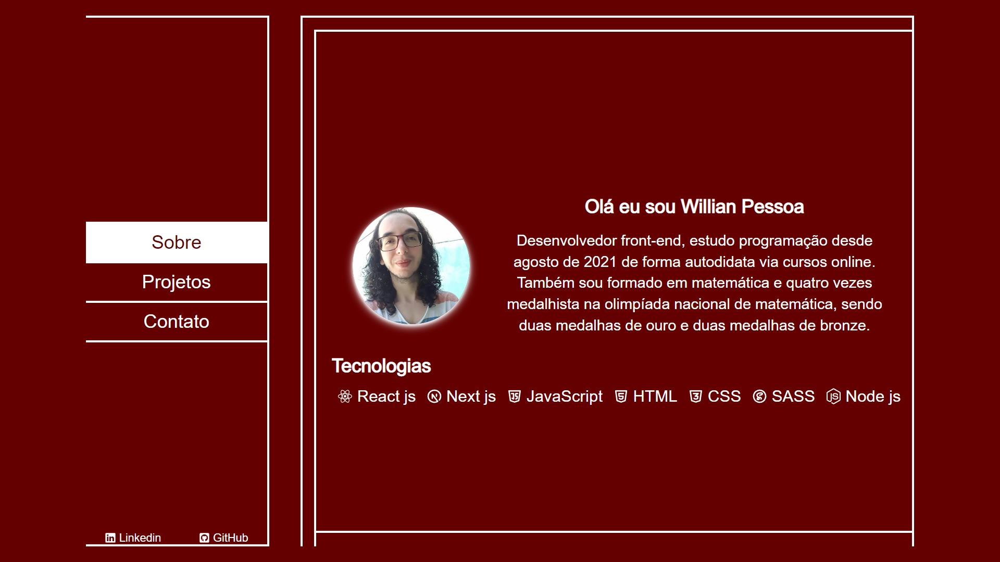

# Portfolio Willian Pessoa

Uma pagina pessoal para apresentar sobre Willian Pessoa (autor), alguns projetos e links de contato. Com a ideia de possuir um design mais minimalista.

### [Demo](https://portfolio-willian-pessoa.vercel.app/)

## Project Status

A base do projeto está finalizada, mas com possíveis melhorias a ser feitas posteriormente, principais funcionalidades são:

- Usuário pode ver uma barra de navegação com as três seções disponíveis e dois links de contato, LinkedIn e Github.

- As seções são alteradas por uma animação de entrada ou saída na caixa de conteúdo.

- A primeira seção é a sobre, contem um pouco de quem é Willian Pessoa e suas principais tecnologias de conhecimento.

- A segunda seção é a de projetos, contem os dois projetos principais desenvolvidos até o momento.

- A terceira seção é a de contato, contem links de contato, LinkedIn e Github.

## Project Screen Shot(s)

## Installation and Setup Instructions

Clone este repositório. Você precisará de `node` e `npm` instalados globalmente em sua máquina.

Instalação:

`npm install`

Para iniciar o App:

`npm start`

## Reflection

O projeto foi desenvolvido usando Next js, React js, Javascript, HTML, CSS, SCSS e React-Icons. 

Primeiro desafio foi pensar no design do site, eu queria algo mais minimalista que fosse único para mim também, porem eu não sou design, então fiz algumas pesquisas de portfólios para me inspirar e poder construir algo.

Segundo desafio que tive foi devido ao Next js ter atualizado para versão 13, e o último projeto que eu tinha feito usando next, estava na versão 12, então ocorreram algumas modificações que precisei me atualizar sobre.

Terceiro desafio foi escrever o código em si, apesar da prática com os outros projetos 
que já fiz ter facilitado o processo, o framework e a maneira como eu queria que as seções fossem apresentadas trouxe o desafio a mais para a escrita.